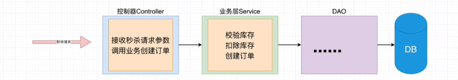
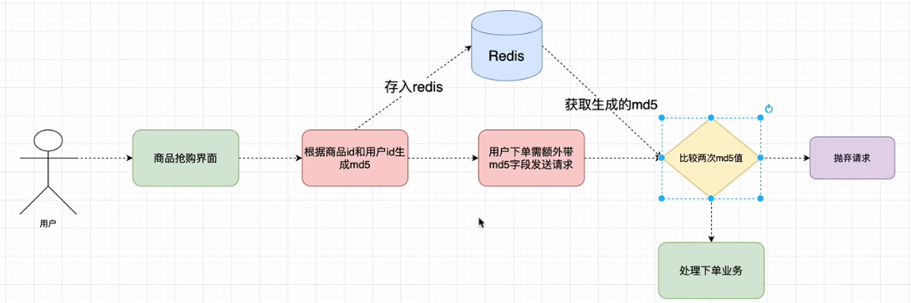
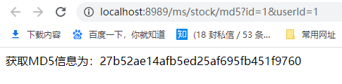
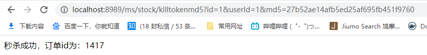
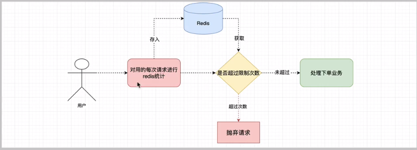
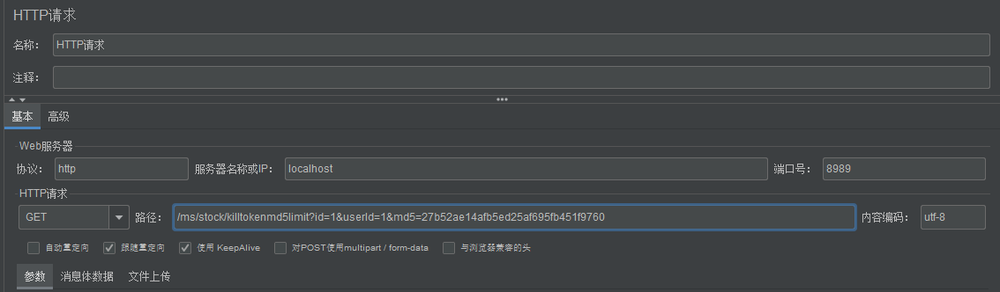
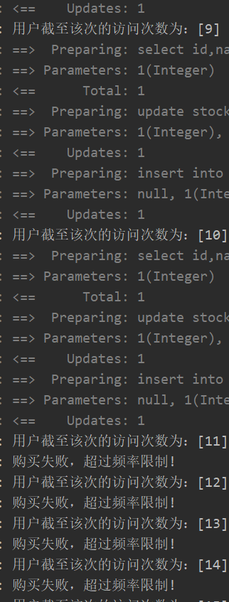

# 秒杀系统

## 1.防止超卖

### 1.1数据库表

```mysql
SET NAMES utf8mb4;
SET FOREIGN_KEY_CHECKS = 0;

-- ----------------------------
-- Table structure for stock
-- ----------------------------
DROP TABLE IF EXISTS `stock`;
CREATE TABLE `stock`  (
  `id` int(11) NOT NULL AUTO_INCREMENT,
  `name` varchar(50) CHARACTER SET utf8 COLLATE utf8_general_ci NOT NULL COMMENT '名称',
  `count` int(11) NOT NULL COMMENT '库存',
  `sale` int(11) NOT NULL COMMENT '已售',
  `version` int(11) NOT NULL COMMENT '乐观锁、版本号',
  PRIMARY KEY (`id`) USING BTREE
) ENGINE = InnoDB AUTO_INCREMENT = 2 CHARACTER SET = utf8 COLLATE = utf8_general_ci ROW_FORMAT = Dynamic;

-- ----------------------------
-- Records of stock
-- ----------------------------
INSERT INTO `stock` VALUES (1, '  iphone', 1000, 0, 0);

-- ----------------------------
-- Table structure for stock_order
-- ----------------------------
DROP TABLE IF EXISTS `stock_order`;
CREATE TABLE `stock_order`  (
  `id` int(11) NOT NULL AUTO_INCREMENT,
  `sid` int(11) NOT NULL COMMENT '库存ID',
  `name` varchar(30) CHARACTER SET utf8 COLLATE utf8_general_ci NOT NULL COMMENT '商品名称',
  `create_time` timestamp(0) NOT NULL DEFAULT CURRENT_TIMESTAMP(0) ON UPDATE CURRENT_TIMESTAMP(0) COMMENT '创建时间',
  PRIMARY KEY (`id`) USING BTREE
) ENGINE = InnoDB AUTO_INCREMENT = 1417 CHARACTER SET = utf8 COLLATE = utf8_general_ci ROW_FORMAT = Dynamic;

-- ----------------------------
-- Table structure for user
-- ----------------------------
DROP TABLE IF EXISTS `user`;
CREATE TABLE `user`  (
  `id` int(11) NOT NULL AUTO_INCREMENT,
  `name` varchar(80) CHARACTER SET utf8 COLLATE utf8_general_ci NULL DEFAULT NULL COMMENT '用户名',
  `password` varchar(40) CHARACTER SET utf8 COLLATE utf8_general_ci NULL DEFAULT NULL COMMENT '密码',
  PRIMARY KEY (`id`) USING BTREE
) ENGINE = InnoDB AUTO_INCREMENT = 1 CHARACTER SET = utf8 COLLATE = utf8_general_ci ROW_FORMAT = Dynamic;

SET FOREIGN_KEY_CHECKS = 1;
```

### 1.2分析业务



### 1.3开发代码

* DAO

  ```java
  @Mapper
  public interface StockDao {
  
      /**
       * 根据商品id查询库存
       */
      Stock checkStock(Integer id);
  
      /**
       * 根据商品id扣除库存
       * @param stock
       */
      void updateSale(Stock stock);
  }
  ```

  ```java
  @Mapper
  public interface OrderDao {
  
      /**
       * 生成订单
       * @param order
       */
      void createOrder(Order order);
  }
  ```

* Service

  ```java
  @Service
  @Transactional
  public class OrderServiceImpl implements OrderService {
  
      @Autowired
      private StockDao stockDao;
  
      @Autowired
      private OrderDao orderDao;
  
      @Override
      public int kill(Integer id) {
          //根据商品id校验库存
          Stock stock = stockDao.checkStock(id);
          if (stock.getSale().equals(stock.getCount())){
              throw new RuntimeException("库存不足");
          }else{
              //扣除库存
              stock.setSale(stock.getSale()+1);
              stockDao.updateSale(stock);
              //创建订单
              Order order = new Order();
              order.setSid(stock.getId());
              order.setName(stock.getName());
              order.setCreateTime(new Date());
              orderDao.createOrder(order);
              return order.getId();
          }
      }
  }
  ```

* Controller

  ```java
  @RestController
  @RequestMapping("stock")
  public class StockController {
  
      @Autowired
      private OrderService orderService;
  
      @GetMapping("/kill")
      public String kill(Integer id) {
          System.out.println("秒杀商品的id=" + id);
          try {
              //根据秒杀商品id调用秒杀业务
              int orderId = orderService.kill(id);
              return "秒杀成功，订单id为：" + orderId;
          } catch (Exception e) {
              e.printStackTrace();
              return e.getMessage();
          }
  
      }
  }
  ```

### 1.4正常测试

`在正常测试没有任何问题`

### 1.5使用Jmeter进行压力测试

### 1.6乐观锁解决商品超卖问题

​       利用数据库中定义`version`版本号字段以及数据库的`事务`实现在高并发下商品的超卖问题

#### 0.校验库存（不变）

```java
/**
 * 校验库存
 */
private Stock checkStock(Integer id) {
    Stock stock = stockDao.checkStock(id);
    if (stock.getSale().equals(stock.getCount())) {
        throw new RuntimeException("库存不足！！！");
    }
    return stock;
}
```

#### 1.扣除库存

```java
/**
 * 扣除库存
 * @param stock
 */
private void updateSale(Stock stock) {
    //在sql层面完成销量的+1 和版本号的+1， 并且根据商品id和版本号同时查询更新的商品
    int updateRows = stockDao.updateSale(stock);
    if (updateRows == 0){
        throw new RuntimeException("抢购失败！");
    }
}
```

```xml
<update id="updateSale" parameterType="com.yjh.entity.Stock">
    update stock
    set sale = sale+1,
    version = version+1
    where id = #{id}
    and version = #{version}
</update>
```

#### 2.创建订单（不变）

```java
/**
 * 创建订单
 * @param stock
 * @return
 */
private int createOrder(Stock stock) {
    Order order = new Order();
    order.setSid(stock.getId());
    order.setName(stock.getName());
    order.setCreateTime(new Date());
    orderDao.createOrder(order);
    return order.getId();
}
```

## 2.接口限流

`限流：是对某一时间窗口内的请求进行限制，保持系统的可见性和稳定性，防止因流量暴增而导致的系统运行缓慢或宕机。`

### 2.1接口限流

​       高并发的抢购请求下如果不进行接口限流，可能会对服务器造成巨大压力。

### 2.2解决方案

#### 2.2.1令牌桶算法

##### 引入依赖

```pom
<dependency>
    <groupId>com.google.guava</groupId>
    <artifactId>guava</artifactId>
    <version>29.0-jre</version>
</dependency>
```

##### 基本使用

```java
/**
 * 创建令牌桶实例
 */
private RateLimiter rateLimiter = RateLimiter.create(10);

@GetMapping("sale")
public String sale(Integer id) {
    //1.没有获取到token请求，一直请求直到获取到token令牌
    //log.info("等待的时间：" + rateLimiter.acquire());
    //2.设置一个等待时间
    if (!rateLimiter.tryAcquire(2, TimeUnit.SECONDS)) {
        System.out.println("当前请求被限流，无法参与秒杀");
        return "秒杀失败";
    }
    System.out.println("处理业务............");
    return "秒杀成功"
}
```

```java
/**
   * 秒杀方法，使用乐观锁防止超卖+令牌桶限流
   * @param id
   * @return
   */
  @GetMapping("/killtoken")
  public String killtoken(Integer id) {
      System.out.println("秒杀商品的id=" + id);
      //加入令牌桶的限流措施
      if (!rateLimiter.tryAcquire(2, TimeUnit.SECONDS)) {
          System.out.println("抢购失败，当前活动过于火爆，请重试！");
      }
      try {
          //根据秒杀商品id调用秒杀业务
          int orderId = orderService.kill(id);
          return "秒杀成功，订单id为：" + orderId;
      } catch (Exception e) {
          e.printStackTrace();
          return e.getMessage();
      }
  }
```

## 3.隐藏秒杀接口

### 3.1限时抢购的实现

​       使用redis来记录秒杀商品的时间，对秒杀过期的请求进行拒绝处理。

####   1.启动redis

####   2.将秒杀商品放入redis并设置超时

>redis-gulimail:0>set kill1 1 EX 10
>
>"OK"

####   3.抢购中加入时间控制

​           整合redis，引入依赖

```xml
<dependency>
    <groupId>org.springframework.boot</groupId>
    <artifactId>spring-boot-starter-data-redis</artifactId>
</dependency>
```

​          修改配置文件

```yml
spring:
  redis:
    host: 192.168.56.10
    port: 6379
    database: 0
```

​          通过redis控制抢购超时的请求

```java
@Service
@Transactional
public class OrderServiceImpl implements OrderService {
  
    @Autowired
    private StringRedisTemplate stringRedisTemplate;

    @Override
    public int kill(Integer id) {
        //校验redis中秒杀商品是否超时
        if (!stringRedisTemplate.hasKey("kill" + id)) {
            throw new RuntimeException("当前商品的抢购活动已经结束！！");
        }
        //根据商品id校验库存
        Stock stock = checkStock(id);
        //扣除库存
        updateSale(stock);
        //创建订单
        return createOrder(stock);
    }
```

### 3.2抢购接口隐藏

* 每次点击秒杀按钮，先从服务器获取一个秒杀验证值（接口内判断是否到秒杀时间）。

* Redis以缓存用户ID和商品ID为key，秒杀地址为value缓存验证值。

* 用户请求秒杀商品的时候，要带上秒杀验证值进行校验。

  

#### Controller

```java
/**
 * 生成md5
 * @param id
 * @param userId
 * @return
 */
@GetMapping("/md5")
public String getMd5(Integer id,Integer userId){
    String md5;
    try {
        md5 = orderService.getMd5(id,userId);
    } catch (Exception e) {
        e.printStackTrace();
        return "获取MD5失败:"+e.getMessage();
    }
    return "获取MD5信息为："+md5;
}
```

#### Service

```java
@Override
public String getMd5(Integer id, Integer userId) {
    //验证userId存在用户信息
    User user = userDao.getById(userId);
    if (user == null) {
        throw new RuntimeException("用户信息不存在！");
    }
    log.info("用户信息：[{}]", user.toString());
    //验证id    存在商品信息
    Stock stock = stockDao.checkStock(id);
    if (stock == null) {
        throw new RuntimeException("商品信息不存在");
    }
    log.info("商品信息：[{}]", stock.toString());
    //生成hashKey
    String hashKey = "KEY_" + userId + "_" + id;
    //生成md5签名放入redis服务
    String key = DigestUtils.md5DigestAsHex((userId + id + "!Q*js#").getBytes());
    stringRedisTemplate.opsForValue().set(hashKey, key, 120, TimeUnit.SECONDS);
    log.info("Redis写入信息：[{}] [{}]", hashKey, key);
    return key;
}
```

#### 启动项目访问生成md5接口




#### 携带验证值验证下单接口

##### 1.controller

```java
/**
 * 秒杀方法，使用乐观锁防止超卖+令牌桶限流
 * @param id
 * @return
 */
@GetMapping("/killtokenmd5")
public String killtokenmd5(Integer id,Integer userId,String md5) {
    System.out.println("秒杀商品的id=" + id);
    //加入令牌桶的限流措施
    if (!rateLimiter.tryAcquire(3, TimeUnit.SECONDS)) {
        System.out.println("抢购失败，当前活动过于火爆，请重试！");
    }
    try {
        //根据秒杀商品id调用秒杀业务
        int orderId = orderService.kill(id,userId,md5);
        return "秒杀成功，订单id为：" + orderId;
    } catch (Exception e) {
        e.printStackTrace();
        return e.getMessage();
    }
}
```

##### 2.Service

```java
@Override
public int kill(Integer id, Integer userId, String md5) {
    //校验redis中秒杀商品是否超时
//        if (!stringRedisTemplate.hasKey("kill" + id)) {
//            throw new RuntimeException("当前商品的抢购活动已经结束！！");
//        }

    //验证签名
    String hashKey = "KEY_" + userId + "_" + id;
    String s = stringRedisTemplate.opsForValue().get(hashKey);
    if (s == null){
        throw new RuntimeException("没有携带验证签名，请求不合法！");
    }
    if (!s.equals(md5)) {
        throw new RuntimeException("当前数据不合法，请稍后再试！");
    }

    //根据商品id校验库存
    Stock stock = checkStock(id);
    //扣除库存
    updateSale(stock);
    //创建订单
    return createOrder(stock);
}
```



### 3.3单用户限制频率

* 具体流程

  

  

#### 1.Controller

```java
/**
 * 秒杀方法，使用乐观锁防止超卖 + 令牌桶限流 + md5签名 +单用户访问频率限制
 * @param id
 * @return
 */
@GetMapping("/killtokenmd5limit")
public String killtokenmd5limit(Integer id,Integer userId,String md5) {
    //加入令牌桶的限流措施
    if (!rateLimiter.tryAcquire(3, TimeUnit.SECONDS)) {
        log.info("抛弃请求：抢购失败，当前活动过于火爆，请重试");
        System.out.println("抢购失败，当前活动过于火爆，请重试！");
    }
    try {
        //加入单用户限制调用频率
        int count = userService.saveUserCount(userId);
        log.info("用户截至该次的访问次数为：[{}]",count);
        //进行调用次数判断
        boolean isBanned = userService.getUserCount(userId);
        if (isBanned){
            log.info("购买失败，超过频率限制!");
            return "购买失败，超过频率限制!";
        }

        //根据秒杀商品id调用秒杀业务
        int orderId = orderService.kill(id,userId,md5);
        return "秒杀成功，订单id为：" + orderId;
    } catch (Exception e) {
        e.printStackTrace();
        return e.getMessage();
    }
}
```

#### 2.Service

```java
@Service
@Transactional
@Slf4j
public class UserServiceImpl implements UserService {

    @Autowired
    private StringRedisTemplate stringRedisTemplate;

    @Override
    public int saveUserCount(Integer userId) {
        //根据不同用户id生成调用次数的key
        String limitKey = "LIMIT_" + userId;
        //获取redis中指定Key的调用次数
        String limitNum = stringRedisTemplate.opsForValue().get(limitKey);
        int limit = -1;
        if (limitNum == null) {
            //第一次调用,放入redis中设置为0
            stringRedisTemplate.opsForValue().set(limitKey, "0", 3600, TimeUnit.SECONDS);
        } else {
            //不是第一次调用,每次加一
            limit = Integer.valueOf(limitNum) + 1;
            stringRedisTemplate.opsForValue().set(limitKey, String.valueOf(limit), 3600, TimeUnit.SECONDS);
        }
        //返回调用次数
        return limit;
    }

    @Override
    public boolean getUserCount(Integer userId) {
        String limitKey = "LIMIT_" + userId;
        //根据用户调用次数的key获取redis中调用次数
        String limitNum = stringRedisTemplate.opsForValue().get(limitKey);
        if (limitNum == null) {
            //为空直接抛弃说明key出现异常
            log.error("该用户没有访问申请验证值记录，疑似异常");
            return true;
        }
        //false代表没超过
        return Integer.parseInt(limitNum) > 10;
    }
}
```



